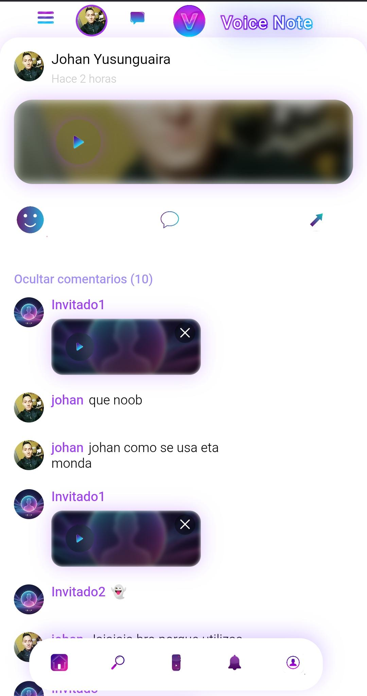

# 🎙️ Voice Note

Una aplicación moderna de notas de voz desarrollada con **HTML, CSS y JavaScript**, enfocada en ofrecer una experiencia limpia, rápida e intuitiva para grabar, organizar y reproducir notas de audio.  

El proyecto busca simular una aplicación real de productividad con una interfaz moderna, animaciones y una experiencia de usuario fluida.  

---

## 🚀 Demo en Vivo
👉 [Prueba Voice Note aquí](https://joganyt01.github.io/Voice-Note/)

---

## 📸 Capturas de la aplicación

<table>
  <tr>
    <td align="center"><b>Desktop</b></td>
    <td align="center"><b>Mobil</b></td>
  </tr>
  <tr>
    <td></td>
    <td></td>
  </tr>
</table>

---

## ✨ Características

- 🎤 Grabación de notas de voz en tiempo real.  
- ▶️ Reproducción instantánea de audios guardados.  
- 💾 Gestión dinámica de notas de voz.  
- 🎨 Interfaz moderna e intuitiva.  
- ⚡ Animaciones y transiciones suaves.  
- 📱 Diseño responsive adaptable a distintos dispositivos.  
- 🧠 Organización enfocada en productividad y facilidad de uso.  
- 🔊 Experiencia inmersiva con controles interactivos.  

---

## 🛠️ Tecnologías utilizadas

- HTML5  
- CSS3  
- JavaScript  
- Web Audio API  

---

## 📂 Estructura del proyecto

voice-note/  
├── index.html      # Página principal  
├── style.css       # Estilos de la aplicación  
├── script.js       # Lógica principal  
├── assets/         # Recursos multimedia e imágenes  
└── audio/          # Notas de voz y sonidos  

---

## 🎯 Objetivo del proyecto

Voice Note fue desarrollado como un prototipo enfocado en mejorar habilidades de desarrollo frontend, lógica de programación y experiencia de usuario, simulando una aplicación moderna de productividad real.

---

## 🚧 Estado del proyecto

🛠️ En desarrollo — nuevas funcionalidades y mejoras visuales seguirán siendo añadidas.  

---

## 👨‍💻 Autor

Desarrollado con ❤️ por **Johanyt**  

---
